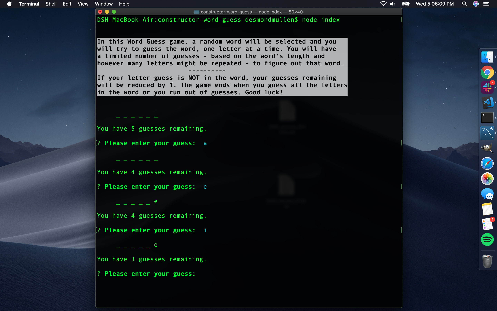
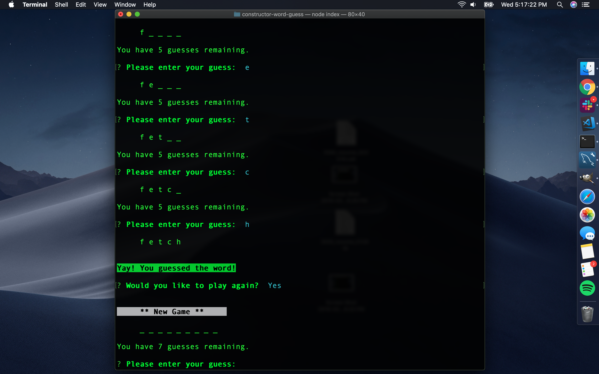
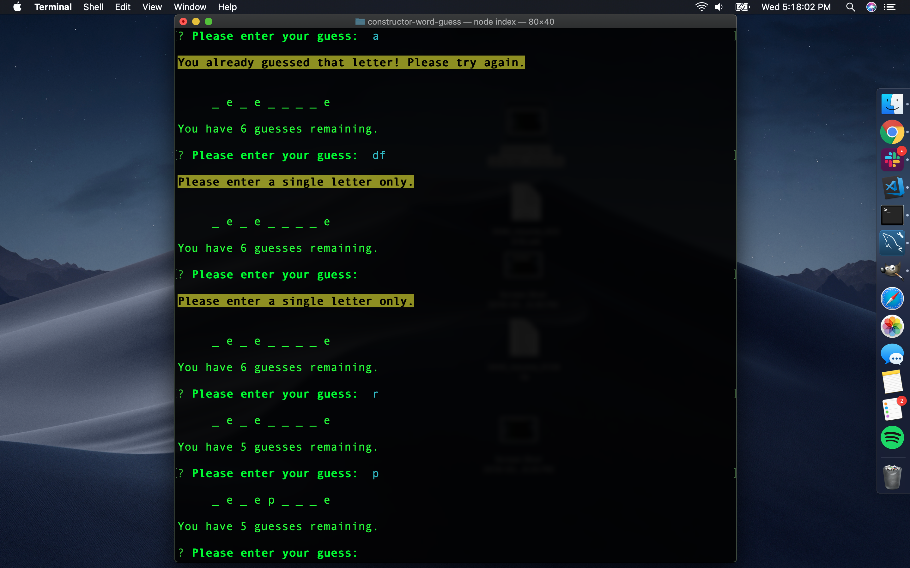

# constructor-word-guess

**The Constructor Word Guess app...**

# Features
In addition to the basic functions of..., this app does the following:

### ADDITIONAL FEATURES:
* User is presented with basic instruction and examples of the use of the app if they type `node liri help`, or simply `node liri` without any parameters.
* Minor implementation of chalk to make the examples-of-use and search action "headlines" easier to read.
* Every use of the app writes data to a log file. Instead of logging the full results of each search, I chose to log only the search parameters (e.g., 'concert-this Paul McCartney') so that log.txt - the list of past searches - could be easily used to generate random searches when a user types `node liri do-what-it-says` without additional parameters.
* Additionally, do-what-it-says can be invoked with a simple parameter ('concert', 'song', or 'movie', e.g., `node liri do-what-it-says concert` to get results for the corresponding "default" searches contained in the random.txt file.

### SCREENSHOTS:
1. `node liri` without arguments brings up basic instructions and examples:

2. `node liri concert-this The Who`:

3. `node liri spotify-this-song Sign of the Times`:
